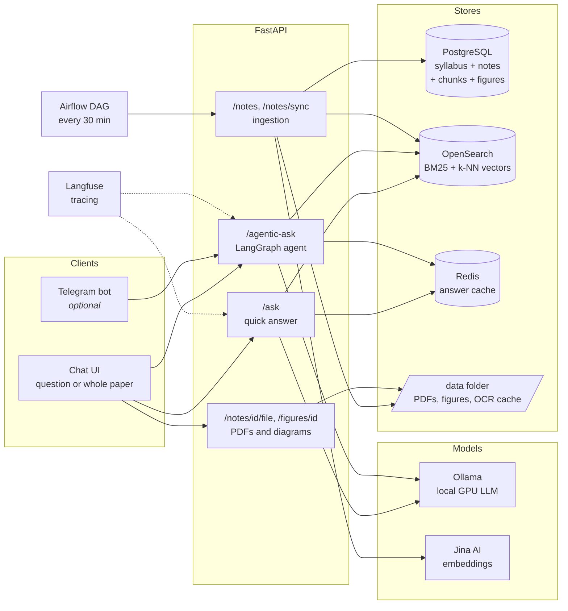
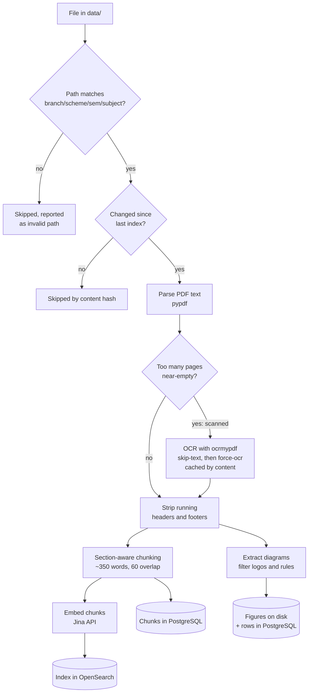
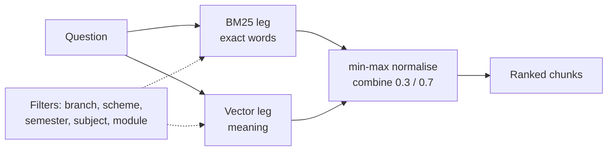
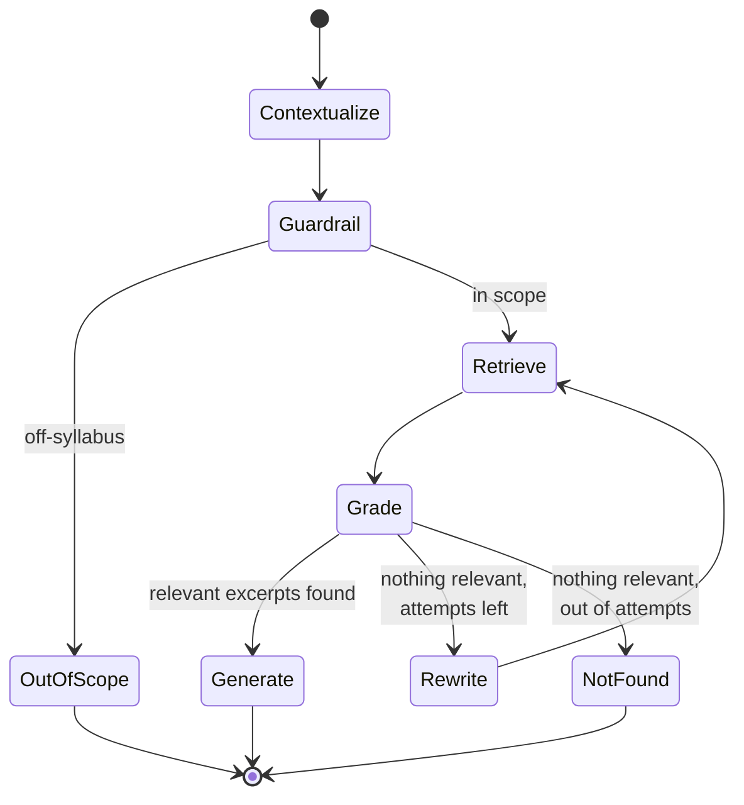
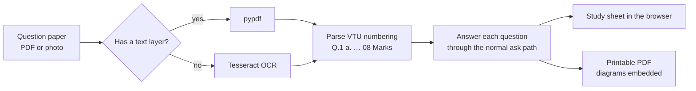
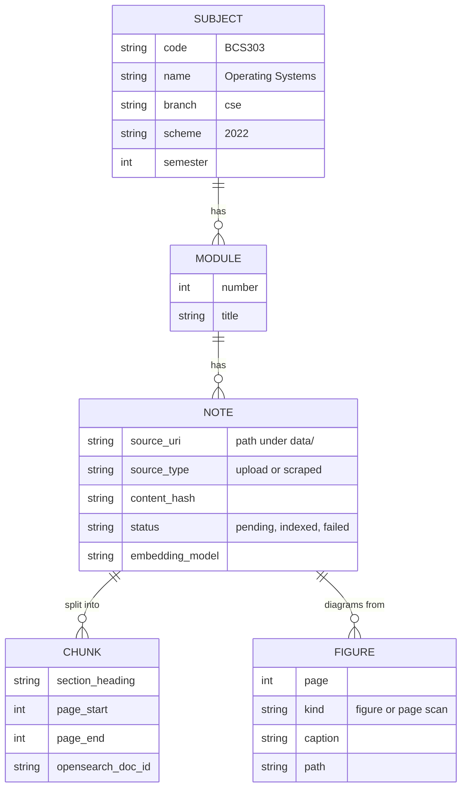

# 📘 ChatVTU

**Ask your VTU notes a question, get an exam-ready answer — with the source PDF and its diagrams.**

*A RAG assistant for VTU engineering students, running entirely on your own machine.*

An agentic retrieval-augmented generation (RAG) system for students of **Visvesvaraya Technological
University**. Drop your module notes into a folder; the system parses them (OCR'ing scanned
photocopies), indexes them for hybrid keyword + semantic search, and answers questions using *only*
what your notes actually say — then links the source PDF at the page it used and shows the diagrams
from that page, because VTU answers usually want one drawn.

Ask one question, or upload a whole past paper and get every question answered as a printable PDF.

Everything runs on your own machine: `docker compose up --build`, with the LLM on your GPU via Ollama.
No API keys are required to get started.

---

## What an answer looks like

> **Q: Explain the memory layout for a multiprogramming system**
>
> **Definition:** A memory layout where multiple jobs are kept in memory simultaneously, increasing CPU
> utilisation by organising jobs so the CPU always has one to execute.
>
> - The operating system keeps several jobs in memory as a subset of the job pool…
>
> **Diagrams from these notes**
> *Fig - Memory layout for a multiprogramming system — BCS303 · Module 1 · p. 9*
>
> **From your notes**
> - [BCS303 Operating Systems · Module 1 — module1](#) — pages 9, 10, 14

The answer is grounded in retrieved excerpts, the diagram comes from the same page, and the link opens
the original PDF at page 9.

---

## Contents

- [How it works](#how-it-works) · [Quick start](#quick-start) · [Adding your notes](#adding-your-notes)
- [Ingestion in detail](#ingestion-in-detail) · [Retrieval](#retrieval) · [The agent](#the-agent)
- [Follow-up questions](#follow-up-questions) · [Whole question papers](#whole-question-papers)
- [API](#api) · [Configuration](#configuration)
- [Development](#development)

---

## How it works



Three things happen: **notes go in** (ingestion), **a question comes in** (retrieval), and **an answer
comes out** (generation, with sources and diagrams).

---

## Quick start

**Prerequisites:** Docker Desktop (WSL2 GPU support on Windows) or Docker Engine plus the
[NVIDIA Container Toolkit](https://docs.nvidia.com/datacenter/cloud-native/container-toolkit/), and
roughly 12 GB of free RAM for the full stack.

```bash
git clone https://github.com/ProblematicPP/vtu-rag-assistant.git
cd vtu-rag-assistant
cp .env.example .env
docker compose up --build
```

First start downloads the LLM (`llama3.2:3b`, about 2 GB) and boots eight services. When the API
reports healthy, open **<http://localhost:7860>**.

| Service | URL | Notes |
|---|---|---|
| **The app** (React) | <http://localhost:7860> | chat with your notes, or attach a paper |
| API docs (Swagger) | <http://localhost:8000/docs> | every endpoint, try-it-out |
| Health | <http://localhost:8000/health> | per-service status |
| Airflow | <http://localhost:8080> | `admin` / `admin` |
| Langfuse | <http://localhost:3000> | `admin@example.com` / `vtu-rag-admin` |
| OpenSearch | <http://localhost:9200> | raw index |

<details>
<summary><b>No NVIDIA GPU?</b></summary>

```bash
docker compose -f docker-compose.yml -f docker-compose.cpu.yml up --build
```
Answers then take tens of seconds instead of a few.
</details>

<details>
<summary><b>Port already in use?</b></summary>

Every host port is configurable in `.env` — `API_HOST_PORT`, `WEB_HOST_PORT`, `POSTGRES_HOST_PORT`,
`OPENSEARCH_HOST_PORT`, `REDIS_HOST_PORT`, `AIRFLOW_HOST_PORT`, `LANGFUSE_HOST_PORT`.
</details>

<details>
<summary><b>Better answers</b></summary>

The default `llama3.2:3b` fits in 6 GB of VRAM and replies in a few seconds, but being small it
sometimes adds detail that isn't in your notes. With more VRAM set `OLLAMA_MODEL=qwen2.5:7b-instruct`
in `.env`, then `docker compose run --rm ollama-init`.

Add a free [Jina AI key](https://jina.ai/embeddings) as `JINA_API_KEY` to turn on semantic search;
without it retrieval is keyword-only (see [Retrieval](#retrieval)).
</details>

---

## Adding your notes

Files go under `data/`, and the folder path is what tags each note:

```
data/<branch>/<scheme>/sem<N>/<SUBJECT_CODE>/module<N>[-anything].<pdf|md|txt>

data/cse/2022/sem3/BCS303/module1.pdf
data/cse/2022/sem3/BCS303/module2-process-management.pdf
data/cse/2022/sem4/BCS403/module1.pdf
```

Then index them — any one of:

```bash
docker compose exec api python scripts/ingest.py      # CLI (--force to re-index everything)
curl -X POST localhost:8000/api/v1/notes/sync         # API
```

…or upload a single file, which is filed into the right folder for you:

```bash
curl -F file=@os-module2.pdf -F subject_code=BCS303 -F module_number=2 \
     http://localhost:8000/api/v1/notes
```

…or just wait: the **Airflow DAG** re-indexes every 30 minutes, and the API syncs on startup.

Subject names and module titles come from [`data/catalog.yaml`](data/catalog.yaml), seeded for the
**CSE 2022 scheme** — check it against the official syllabus and extend it for your branch. Unknown
subject codes still work; they just show their code as the name.

---

## Ingestion in detail



**Scanned notes.** Most VTU notes in circulation are photocopies: pages of images with no text layer.
When too many pages come back near-empty, the PDF is run through
[ocrmypdf](https://ocrmypdf.readthedocs.io) (Tesseract) to gain one. A junk text layer triggers a second
pass with `--force-ocr`. OCR costs 1–3 s per page, so results are cached in `data/.ocr-cache` keyed by
file content — re-indexing never pays twice. For other languages add the Tesseract pack to the
Dockerfile (`tesseract-ocr-kan`) and set `OCR_LANGUAGE=eng+kan`.

**Running headers and footers.** Lines like *"Karthikeyan S M, Asst. Professor, Dept. of CSE, SVIT"*
repeat on every page; left in they waste context and get mistaken for section headings. Lines appearing
on ≥60% of pages (short ones only, page numbers normalised away) are removed before chunking.

**Section-aware chunking.** Notes are split at detected headings — markdown `#`, numbered `2.3 Paging`,
`MODULE 2`, short ALL-CAPS lines — then each section is packed into ~350-word chunks with a 60-word
overlap. Chunks keep their heading path (`Module 1 > 1.3 Dual-Mode Operation`) and page range, which is
what makes page-accurate source links possible. Tiny sections merge into the next.

**Diagrams.** Every embedded image is extracted; logos and watermarks (the same image recurring across
pages), bullet icons and horizontal rules are filtered out, and captions like *"Fig. 1.2 Layered
operating system"* are picked up from the page text. For scanned notes the page image itself is kept.

**Housekeeping.** Notes are skipped when unchanged (content hash), re-embedded when you add an
embeddings key later, and pruned from the index when you delete the file.

---

## Retrieval

Each chunk is indexed twice: as **text** for BM25 keyword scoring, and as a **1024-dimension vector**
(Jina `jina-embeddings-v3`) for semantic similarity in a Lucene HNSW k-NN field.



Keyword search alone misses paraphrases — *"deadlock avoidance"* won't match *"the Banker's algorithm
keeps the system in a safe state"*. Vector search alone misses exact terms like subject codes. Hybrid
runs both and merges the rankings through an OpenSearch normalisation pipeline. **Without
`JINA_API_KEY` the vector leg is skipped and search runs BM25-only** — it works, just less forgiving of
paraphrase.

---

## The agent

`/ask` does one retrieval and one generation. `/agentic-ask` adds a LangGraph loop that checks itself:



- **Contextualize** — resolves a follow-up against the conversation, so *"explain them briefly"*
  becomes a question that can be searched. See [Follow-up questions](#follow-up-questions).
- **Guardrail** — scores whether the question belongs to the VTU syllabus scope. *"Best biryani in
  Bangalore"* is declined in under a second, without touching the index. If the classifier itself
  fails, the question is allowed through rather than wrongly blocked.
- **Grade** — the model marks which retrieved excerpts actually bear on the question.
- **Rewrite** — when nothing is relevant, the query is rewritten (up to `AGENT_MAX_REWRITES`) and
  retrieval runs again.
- **Generate** — answers from the excerpts only, and says so plainly when the notes don't cover it.
  Answers carry no citation markers; the source notes are linked whole instead.

Every step is traced to **Langfuse** and returned in the response as a `steps` log, so you can see
exactly why an answer came out the way it did.

---

## Follow-up questions

Retrieval is stateless: *"explain them briefly"* names nothing, so searching those three words
finds noise. The conversation therefore travels with each request, and a message that leans on it
is rewritten into one that stands on its own **before** anything is searched.

```
you:  List the different operating modes
      → user mode, kernel mode, dual-mode operation, SMP, clustering, …

you:  explain them briefly
      → searched as "explain user mode, kernel mode, dual-mode operation, … briefly"
```

Two details keep this cheap and honest:

- **The rewrite only runs when it has to.** A message is judged dependent when every word in it is
  glue, a reference, or a way of asking — `"explain them briefly"` has nothing left, `"List its
  types"` has *types*. Ordinary questions never pay for the extra call.
- **A bad rewrite is visible, not silent.** The resolved question comes back as
  `resolved_question` and the UI prints *answered as "…"* under the answer, so a wrong guess is
  something you can see rather than something that quietly answers the wrong thing. If the rewrite
  fails or resolves nothing, the question is searched exactly as you typed it.

Only the last three turns are used, and each previous answer is reduced to its opening plus the
topics it named — a plural *"them"* has to be able to reach all of them, not just the ones that
survived a character limit.

---

## Whole question papers

Attach a past paper to the composer — a PDF, or a photo taken on your phone — and every question is
answered into the conversation, then offered as a PDF you can print.



The parser understands how VTU papers are written: lettered sub-parts are separate answerable
questions, marks are read from the margin, questions wrapped across lines are joined, and the
university header, USN box and "answer any FIVE" instructions are discarded.

Each question is answered in turn — a single GPU serves the model, so answers arrive one by one and
the sheet fills in as they land. The PDF pass reuses the cached answers, so it is quick.

| Method | Path | Purpose |
|---|---|---|
| `POST` | `/api/v1/papers/extract` | Read the questions out of a paper |
| `POST` | `/api/v1/papers/answer` | Answer them all, as JSON |
| `POST` | `/api/v1/papers/pdf` | Answer them all, as a printable PDF |

The PDF is set for paper: a serif face at printable size, each question kept with the start of its
answer, diagrams inline at a size you can copy from, and the source note named under every answer.

## API

| Method | Path | Purpose |
|---|---|---|
| `GET` | `/health` | Status of Postgres, OpenSearch, Redis, LLM, embeddings, Langfuse |
| `GET` | `/api/v1/subjects` | List subjects (`branch`, `scheme`, `semester` filters) |
| `GET` | `/api/v1/subjects/{code}/modules` | Modules with note counts |
| `POST` | `/api/v1/notes` | Upload and index a note |
| `POST` | `/api/v1/notes/sync` | Index new/changed notes from `data/` (`?force=true`) |
| `GET` | `/api/v1/notes`, `/api/v1/notes/{id}` | Inspect notes and their status |
| `GET` | `/api/v1/notes/{id}/file` | **Open the original PDF** (supports `#page=N`) |
| `GET` | `/api/v1/notes/{id}/figures` | Diagrams extracted from a note |
| `GET` | `/api/v1/figures/{id}` | Fetch one diagram image |
| `POST` | `/api/v1/search` | Hybrid / BM25 / vector search over chunks |
| `POST` | `/api/v1/ask` | Quick answer |
| `POST` | `/api/v1/agentic-ask` | Full agent run |
| `POST` | `/api/v1/papers/extract`, `/answer`, `/pdf` | Whole question papers (see above) |

Search and both ask endpoints accept the same filters: `branch`, `scheme`, `semester`, `subject_code`,
`module_numbers`.

```bash
curl -X POST localhost:8000/api/v1/agentic-ask -H 'content-type: application/json' \
  -d '{"question": "Explain dual-mode operation", "subject_code": "BCS303"}'
```

The response carries the `answer`, the source `notes` (each with its PDF URL and the pages used), the
`figures` to draw, the retrieved `sources`, the guardrail verdict, any rewritten queries, and the
agent's `steps`.

---

## Configuration

All settings live in `.env` ([`.env.example`](.env.example) documents every key).

| Group | Keys | What they control |
|---|---|---|
| LLM | `LLM_PROVIDER`, `OLLAMA_MODEL`, `LLM_TEMPERATURE` | Ollama by default; Groq/Together via `LLM_PROVIDER=groq` + `LLM_API_KEY` |
| Embeddings | `JINA_API_KEY`, `JINA_MODEL` | Semantic half of hybrid search |
| Chunking | `CHUNK_TARGET_WORDS`, `CHUNK_OVERLAP_WORDS` | Chunk size and overlap |
| OCR | `OCR_ENABLED`, `OCR_LANGUAGE`, `OCR_MIN_WORDS_PER_PAGE` | Scanned-note handling |
| Diagrams | `FIGURES_ENABLED`, `FIGURES_MIN_WIDTH`, `FIGURES_MAX_PER_ANSWER` | What counts as a diagram |
| Agent | `AGENT_MAX_REWRITES`, `AGENT_GUARDRAIL_THRESHOLD`, `AGENT_TOP_K` | Agent behaviour |
| Cache | `CACHE_ENABLED`, `CACHE_TTL_SECONDS` | Redis answer cache |
| Tracing | `LANGFUSE_PUBLIC_KEY`, `LANGFUSE_SECRET_KEY` | Blank them to disable tracing |

**Swapping the LLM provider.** `LLMProvider` ([services/llm/](src/vtu_rag/services/llm/)) is an
interface with two implementations: Ollama (default) and an OpenAI-compatible client that covers Groq,
Together and anything else speaking that protocol. Nothing else in the codebase knows which is in use.

---

## Optional services

```bash
docker compose --profile telegram up -d telegram-bot   # needs TELEGRAM_BOT_TOKEN
docker compose --profile dashboards up -d              # OpenSearch Dashboards on :5601
```

---

## Development

```bash
uv sync                          # Python 3.11–3.13
uv run pytest                    # 147 unit tests, no services needed
uv run ruff check src tests

# API on the host against the compose services
docker compose up -d postgres opensearch redis ollama
POSTGRES_HOST=localhost OPENSEARCH_HOST=http://localhost:9200 REDIS_HOST=localhost \
OLLAMA_HOST=http://localhost:11434 DATA_DIR=data uv run uvicorn vtu_rag.main:app --reload
```

The interface is a separate Vite app. `npm run dev` proxies `/api` and `/health` to the API on
port 8000, exactly as nginx does inside the container, so it talks to one origin either way:

```bash
cd frontend
npm install
npm run dev                      # http://localhost:5173, hot reload
npm run build                    # type-check, then build what nginx serves
```

Changing Python source means rebuilding the image — `src/` is baked in, not mounted, so
`docker compose restart api` keeps running the old code:

```bash
docker compose up -d --build api
```

```
src/vtu_rag/
  config.py          env-driven settings            container.py   service wiring
  models/            Subject → Module → Note → Chunk, Figure
  repositories/      database access
  ingestion/         path parser, parsers, OCR, chunker, figures, pipeline, sources
  services/          embeddings, search, llm, rag, cache, tracing, figure store
  agent/             LangGraph state, graph, service
  routers/           FastAPI endpoints              schemas/       request/response models
  bots/              Telegram bot
frontend/            React app (Vite + TypeScript), served by nginx
airflow/dags/        scheduled re-index DAG
scripts/ingest.py    ingestion CLI
tests/               unit tests for chunking, parsing, OCR, figures, search, agent routing
```

The data model mirrors the syllabus:



**Extension point for scraping:** `ScraperSource` in
[ingestion/sources.py](src/vtu_rag/ingestion/sources.py) implements the same `NoteSource` interface as
the local folder reader — fill in `discover()` to pull notes from a public VTU resource site, and the
rest of the pipeline works unchanged.

---

## Acknowledgements

Architecture inspired by studying the open-source
[production-agentic-rag-course](https://github.com/jamwithai/production-agentic-rag-course) (MIT). This
is an independent implementation for a different domain, with its own data model, ingestion pipeline
and features.

## License

[MIT](LICENSE)
